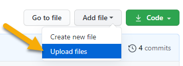

# Parish Council downloads

This is where you upload files which can be downloaded from the website.

**Don't use this for meeting minutes - those need to be uploaded [here](https://github.com/haresfield-pc/minutes).**

Each time you upload or delete a file it will trigger an update of the Parish Council website. 

It will take a minute or two for the update, then you will see the new file in the downloads list:

> https://haresfield-pc.org/downloads/

## How to upload a new file

1. Click the _Add file_ button at the top of this page, then click _Upload files_:

2. Drag the file into the window from your file explorer, or click _choose your files_ to select the file from your computer:

3. Click the _Commit changes_ button at the bottom of the page:

## How to delete a file

1. Click on the filename from the list above - e.g. to delete the Herald PDF:

2. Click the bin icon at the top of the file contents:

3. Click _Commit changes_:

## File details

You can upload any type of file with any filename.

Downloads will be listed in alphabetical order on the website.